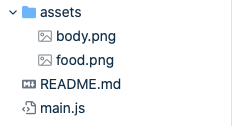
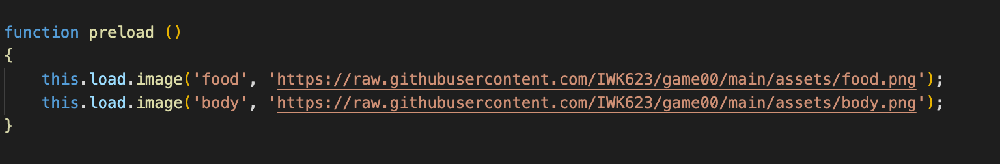

# Game Hav

Phaserで作成したゲームを、 GitHabから読み込むことができます。
https://phaser.io

### 1. Phaserのファイル構造

このように、ファイルを作成してください。ゲームで使用するテクスチャなどのpngファイルはassets直下に配置します。

また、main.js内でロードする時は、次のようにパスを指定します。

Game-Havでは自動でGitHubのリンクに置き換えられます。

### 2. リンク作成
https://game-hav.web.app/game/
リンクにアクセスし、GitHubのアカウント名と、リポジトリ名を入れてリンクを作成できます。
作成したリンクはSNSでシェアし、誰でもあなたが作成したゲームで遊ぶことができます。

### サンプル
https://github.com/IWK623/game00
